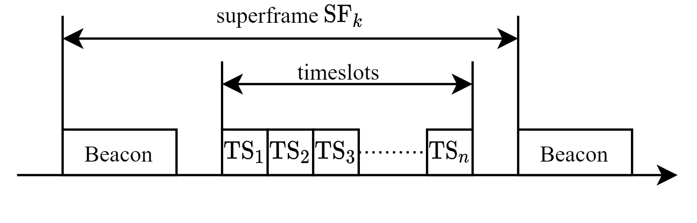
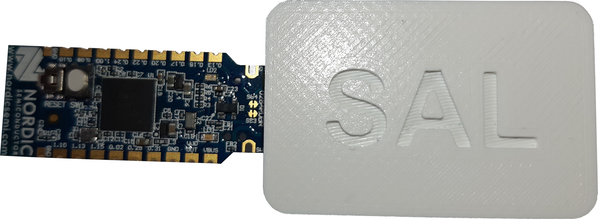
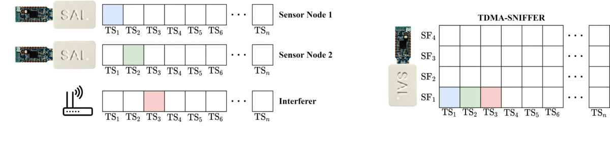
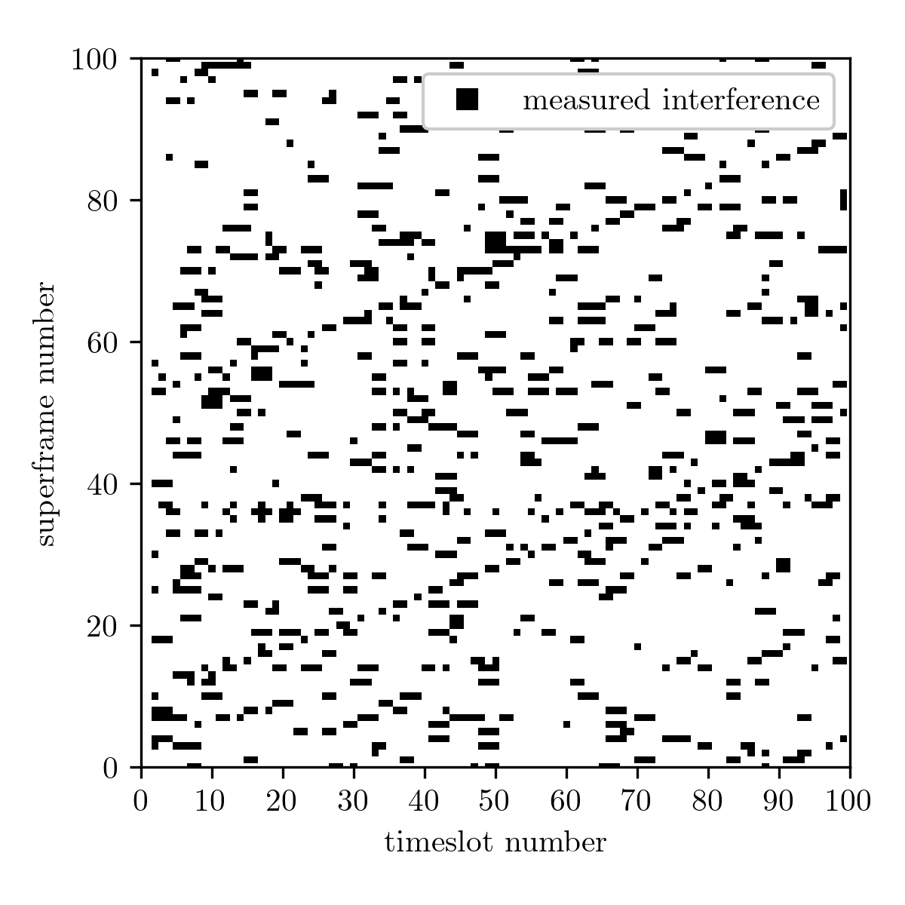

# InSecTT TMDA Interference Dataset

This dataset provides interference measurements with a wireless sensor network (WSN) based on a time division multiple access (TDMA) protocol running on low-cost hardware. The WSN consists of a network coordinator and several measurement nodes, where each device is allowed to transmit at a certain timeslot. For the interference measurements, special measurement nodes are introduced, that measure the average signal level of all possible timeslots and send the data to the network coordinator. This provides a somehow continuous measurement of the signal level in the channel. Since only the average signal level is considered, the channel access of different communication protocols can be evaluated. Furthermore, if a device shows deterministic access to the channel, e.g. periodic access, certain patterns can be observed in the measurements. These patterns can be used to identify the source and apply countermeasures for the WSN.

This dataset is a work from [Silicon Austria Labs GmbH](https://silicon-austria-labs.com/) (SAL) and the [Institute for Communications Engineering and RF-Systems](https://www.jku.at/en/institute-for-communications-engineering-and-rf-systems/)  (NTHFS) of the Johannes Kepler University (JKU) in Linz for the [InSecTT project](https://www.insectt.eu/).

# Measurement Procedure

## Hardware and Protocol
Measurements in this dataset are conducted with the Energy and Power  Efficient  Synchronous  Sensor Network (EPhESOS) protocol [1]. EPhESOS is a TDMA network protocol for industrial applications, where every node within the network gets a dedicated timeslot where it is allowed to transmit data. The beacon of the network coordinator and the possible timeslots are collected in a so-called superframe that is repeated continuously.  The following figure depicts the superframe format of the EPhESOS protocol.
<p align="center">

</p>
For the measurements in this dataset a superframe duration of 100 ms with 100 timeslots 0.9 ms each was choosen. 


As a hardware platform, the Nordic™ NRF52840 controller with integrated transceiver was used. For the communication in the WSN, the EPhESOS protocol is combined with the Bluetooth Low Energy (BLE) physical layer. 
<p align="center">

</p>


The measurements themselves are conducted by sniffer nodes,  which report the average signal level of each timeslot to the network coordinator. The average signal level of the timeslots is measured using energy detection, a feature in 802.15.4, and available in many commercial transceiver controllers like the  NRF52840. It allows an automatic averaging of the signal level in the current channel for a duration of 128 μs, which is used to measure the signal level within all timeslots in the superframes. 


## Schematic of the Interference Detection

Sensor nodes that belong to the same TDMA-WSN have a dedicated timeslot, where they are allowed to transmit data. Devices that are not part of the network do not follow the TDMA structure. Interference from these devices can appear at any timeslot, however, if the communication of these devices is somehow periodic, a certain pattern can be observed if multiple superframes are considered.
The figure in the following depicts the measurement of a sniffer node for four superframes. The interferer sends periodically, but with a slightly higher period compared to the superframe duration. As a result, the observation of the interference
shifts to a later timeslot (i.e. higher timeslot number) with
every new superframe. The resulting pattern can be seen on the right.

<p align="center">

</p>


# Example Measurement
The following figure shows one example measurement of this dataset. The x-Axis represents the timeslot number (in our case 100 timeslots per superframe) and the y-Axis represents the superframes, i.e. the subsequent measurements (100 ms superframe duration). If in a timeslot the measured signal level is above a −90 dBm threshold, it is marked black, otherwise, it is left empty.  In the dataset also the corresponding RSSI values are available, though not depicted here for simplicity. 

In this measurement, two interferers are placed nearby which transmit at a period of 102.4 ms and 92.4 ms, respectively. The following figure depicts the measurement,  showing the interference of the timeslots over 100 superframes.

<p align="center">

</p>

The first interference with the 102.4 ms period is larger compared to the 100 ms superframe duration, therefore the interference is observed in each subsequent superframe shifted to the right, resulting in the two lines moving to the right in the figure. The second interference with 92.4 ms has a lower period, i.e., the resulting interference appears several timeslots earlier in every new superframe. This pattern is hard to distinguish from the additional noise and random access of the real measurement.

# Dataset

## Structure of Dataset
Each subfolder in the [dataset](Dataset) folder represents one measurement set for a certain scenario. Each of these sets contain a [description.json](Dataset/artificial_periodic_interference1/description.json) with the important parameters of the measurement, the corresponding manufacturer ID of the sniffer nodes, and the timeslot they are operating. Additionally, there is a "measurement_setup" field that contains a description of the setup and peculiarity of this measurement set.

The actual measurement of the sniffer nodes can be found in the [snifferX.csv](Dataset/artificial_periodic_interference1/sniffer1.csv) that contains the RSSI values of each TDMA-timeslot for each measured superframe. If for certain superframes and/or timeslots measurements are not available the specific fields are left empty.

## Loading the Dataset
The sniffer measurements are provided as a CSV file which allows opening the data in various programming languages and programs. For Python we shall give a small code example to open the sniffer measurement with Pandas and convert the superframe number and the measurements itself to NumPy arrays for further evaluation:


```python
#import needed packages
import pandas as pd
import numpy as np

#load dataframe (make sure to use ',' as separator and "SF" as index)
df = pd.read_csv("test_set/sniffer1.csv", sep=',' , index_col = "SF")

#get 1D-array of superframe numbers
superframe_number = df.index.to_numpy()
#get 2D-array of sniffer values (RSSI for each superframe and timeslot)
sniffer_measurement = df.to_numpy()    
```

# Contact
If you have any comments, questions or feedback please contact
- Julian Karoliny: julian.karoliny@silicon-austria.com

# License 
This dataset is distributed under the [Creative Commons Attributions License 4.0 (CC-BY 4.0)](https://creativecommons.org/licenses/by/4.0/).


# Acknowledgement
This work is funded by the InSecTT project (https://www.insectt.eu/). InSecTT has received funding from the ECSEL Joint Undertaking (JU) under grant agreement No 876038. The JU receives support from the European Union’s Horizon 2020 research and innovation programme and Austria, Sweden, Spain, Italy, France, Portugal, Ireland, Finland, Slovenia, Poland, Netherlands, Turkey. The document reflects only the author’s view and the Commission is not responsible for any use that may be made of the information it contains.

# Literature

[1] H.  Bernhard,  A.  Springer,  A.  Berger,  and  P.  Priller,    “Life  cycle  of wireless  sensor  nodes  in  industrial  environments,”  in2017  IEEE  13th International  Workshop  on  Factory  Communication  Systems  (WFCS), 2017, pp. 1–9.